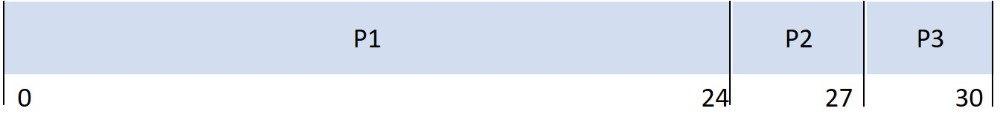
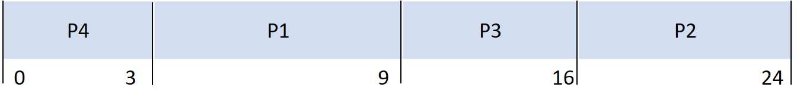
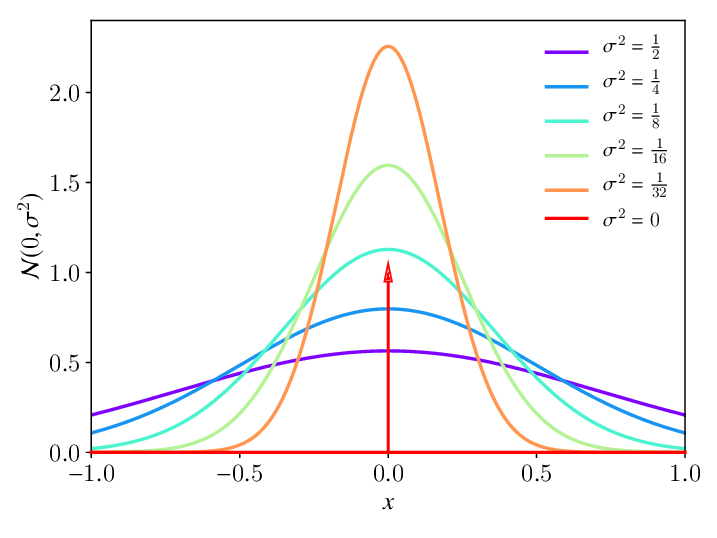
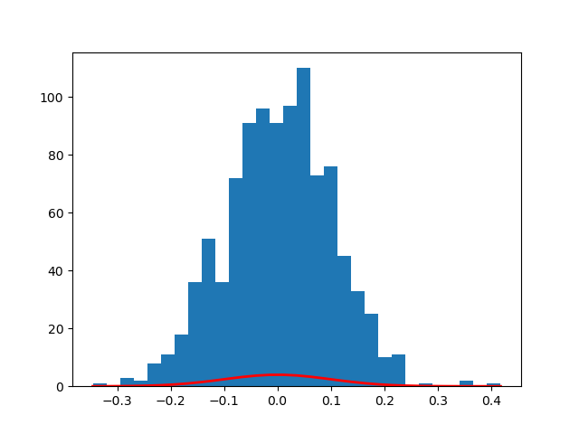

# CPU Algoritmaları Modellemesi

Bu projede CPU üzerinde proseslerin çalışması modellenecektir.

## Proses Durum Diyagramı

Aşağıda proseslerin yaşam döngüsü anlatılmaktadır.


- **Admitted:** Bir prosesin oluşma olaydır.
Oluşan proses CPU'da çalışmak üzere ready kuyruğunda bekler.

- **Scheduler Dispatch:** Ready kuyruğundaki prosesler çeşitli algoritmalara göre seçilerek CPU'da çalıştırılır.
Bu algoritmalarlardaki ana amaç CPU'yu mümkün olduğunca verimli kullanmaktır.
Bu algoritmalar açıklanacaktır.

- **Interrupt:** Bir proses CPU üzerinde çalışırken başka bir proses tarafından kesme gelebilir.
Bu durumda çalışan proses ready kuyruğuna alınarak kesme oluşturan proses işleme alınır.

- **I/O or event wait:** CPU üzerinde çalışan prosesin I/O işlemi olduğu takdirde
 bu işlemler uzun sürdüğü için CPU bunu beklemeyip başka bir prosese geçmesi gerekir.
  Dolayısıyla Bu proses I/O işlemi bitene kadar waiting kuyruğuna alınır.
  
- **I/O or event completion:** I/O işlemi biten prosesler tekrar çalıştırılmak üzere ready kuyruğuna alınır.

- **Exit:** Prosesin sonlndırılması olayıdır. 

## Proses Sıralama Algoritmaları

#### Proses Sıralama Algoritması Kriterleri

Prosesleri sıralarken baz alınacak kriterler şunlardır:

Ölçüt| Kriter | Açıklama
---|---|---
Max |   CPU Kullanımı       | CPU’yu mümkün olduğunca meşgul tut.
Max |   Çıkış (throughput)  | Birim zamanda çalışmasını tamamlayan proses sayısı
Min |   Tamamlanma zamanı   | Belirli bir prosesin çalışması için gerekli zaman
Min |   Bekleme zamanı      | Hazır kuyruğundaki beklemekte olan prosesin geçirdiği süre
Min |   Cevap zamanı        | Bir istek gönderildikten ilk cevap alınana (çıkış değil) kadarki geçen süre

#### İlk Gelen İlk Çalışır Algoritması (First-Come, First-Served - FCFS)

Prosesler geldiği sırayla çalıştırılırlar.

Proses | Patlama zamanı
---|---
P1 | 24 
P2 | 3
P3 | 3




Bekleme zamanları P1 = 0; P2 = 24; P3 = 27 

Ortalama bekleme zamanı:  (0 + 24 + 27) / 3 = 17

#### En Kısa İş Önce (Shortest-Job-First - SJF) Algoritması

Prosesler arasında patlama zamanı en kısası seçilirek çalıştırılır.

Proses | Patlama zamanı
---|---
P1 | 6
P2 | 8
P3 | 7
P4 | 3




Ortalama bekleme zamanı = (3 + 16 + 9 + 0) / 4 = 7


## Modelleme

### Rastgele Dağılım Türleri

#### Normal Dağılım



```python
import numpy as np
mu, sigma = 0, 0.1  # mean and standard deviation
s = np.random.normal(loc=mu, scale=sigma, size=1000)

import matplotlib.pyplot as plt
count, bins, ignored = plt.hist(s, 30)
plt.plot(bins, 1/(sigma * np.sqrt(2 * np.pi)) *
                np.exp( - (bins - mu)**2 / (2 * sigma**2) ),
          linewidth=2, color='r')
plt.show()
```

